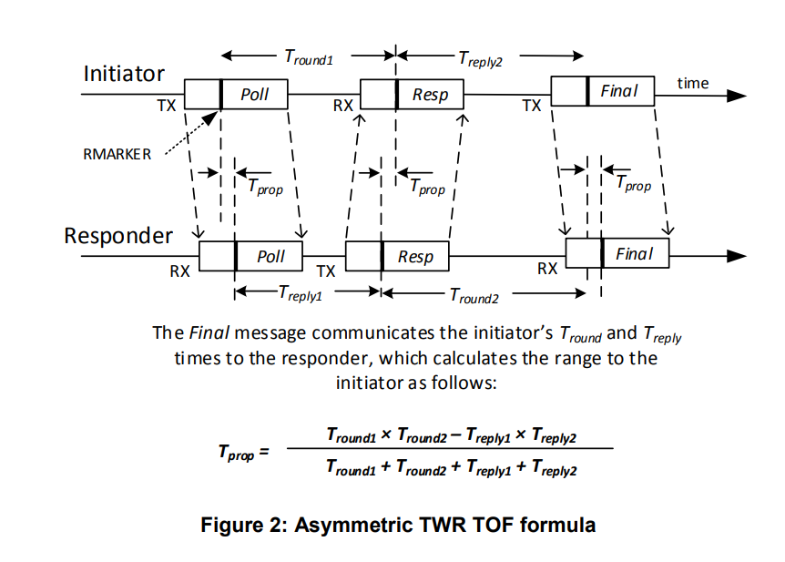

<style>
img { width: 45%;}
</style>

# Ultrawideband Experiments (UWB) for the Time Difference of Arrival (TDoA)

We want to get a system where we can obtain Time Difference of Arrival measurements from Decawave's (DWM1000) devices. Decawave is now acquired by Qorva. 
Mohammed Hussaini replicated a PCB that works with Feather M0 and works with the [`thotro`](https://github.com/thotro/arduino-dw1000) library.

We start by asking the following questions:

1. What does the hardware connection look like (Know your Hardware)?
2. A basic test of the MCU / DWM1000 hardware connectivity.


# Know Your Hardware
<div style="text-align:center">

 

</div>

Which pin in the module is connected to which pin in the Feather M0? What pin in the Feather M0 is connected to which SAMD21 pin? Which IDEs are more convenient for deveopment? We will attempt to answer these questions here!

The Feather M0 pinout [can be found here](https://learn.adafruit.com/assets/110924):

<div style="text-align:center">

</div>


# Thotro Library Issue
The thotro library default file has high speed settings at `20000000L` and `16000000L`

```c
// SPI settings
#ifdef ESP8266
	// default ESP8266 frequency is 80 Mhz, thus divide by 4 is 20 MHz
	const SPISettings DW1000Class::_fastSPI = SPISettings(20000000L, MSBFIRST, SPI_MODE0);
#else
	const SPISettings DW1000Class::_fastSPI = SPISettings(16000000L, MSBFIRST, SPI_MODE0);
#endif
```
This does not work for the arduino Feather M0. Reducing the speed helps. I am currently using `2000000L` instead of `16000000L`. Further evaluation is needed of this!

To diagnose this problem attempt to read the Device ID. Instead of `DECA0130` you will get some gibberish with `EF5...`something!

## EUID Misunderstanding
It seems I had an initial misunderstanding. The EUID is left clear by decawave and is supposed to be filled by the manufacturer (this would be me in this case!!). So this is open for experimentation.

This seems like a useful page:

[Matthias Grob and Manuel Stalder `mbed` Decawave Project](https://os.mbed.com/users/manumaet/code/DecaWave//file/b6120c152ad1/main.cpp/)

To understand how `setEUI` function in `thotro DW1000` library works: consider the following two snippets:

```c
// Line 930 
void DW1000Class::setEUI(byte eui[]) {
	//we reverse the address->
	byte    reverseEUI[8];
	uint8_t     size = 8;
	for(uint8_t i    = 0; i < size; i++) {
		*(reverseEUI+i) = *(eui+size-i-1);
	}
	writeBytes(EUI, NO_SUB, reverseEUI, LEN_EUI);
}
```
and
```c
// Line 1737
void DW1000Class::writeBytes(byte cmd, uint16_t offset, byte data[], uint16_t data_size) {
	byte header[3];
	uint8_t  headerLen = 1;
	uint16_t  i = 0;
	
	// TODO proper error handling: address out of bounds
	// build SPI header
	if(offset == NO_SUB) {
		header[0] = WRITE | cmd;
	} else {
		header[0] = WRITE_SUB | cmd;
		if(offset < 128) {
			header[1] = (byte)offset;
			headerLen++;
		} else {
			header[1] = RW_SUB_EXT | (byte)offset;
			header[2] = (byte)(offset >> 7);
			headerLen += 2;
		}
	}
	SPI.beginTransaction(*_currentSPI);
	digitalWrite(_ss, LOW);
	for(i = 0; i < headerLen; i++) {
		SPI.transfer(header[i]); // send header
	}
	for(i = 0; i < data_size; i++) {
		SPI.transfer(data[i]); // write values
	}
	delayMicroseconds(5);
	digitalWrite(_ss, HIGH);
	SPI.endTransaction();
}
```

The `writeBytes` function accepts four parameters: `cmd`, `offset`, `data` and `data_size`. The values given to this in the `setEUI` function are: 
- `cmd := EUI` the register number
- `offset := NO_SUB` which is the value `0xFF`. According to the code if `offset == NO_SUB` then `header[0] = WRITE | cmd`. Since in `DW1000.h:L547` we have the definition below it means we set the higher bit on the command. This indicates a write operation according to `DW1000 User Manual`

    ```c
    static const byte WRITE      = 0x80; // regular write
    ```
<div style="text-align:center">

</div>

- `data := reverseEUI` memory reversed version of the EUI data.
- `data_size := LEN_EUI` which is defined as 8.

Turns out this `NO_SUB` is part of the addressing mode. The 6th bit of the first byte indicates whether the header will contain a second byte. If it does, the MSB of the second byte indicates whether there is extended subindexing (three header bytes).

<div style="text-align:center">


</div>

# How to do two way ranging (APS013)
The diagram below shows two way ranging scheme as explained by Decawave. The anchor (left) and Tag (right) are the two participants. The tag begins by sending the `Blink` messages meant to find a ranging partner. The anchor responds to one of these by the `RangingInit` message. The Tag now understands it can begin ranging. Ranging starts with the `Poll` message from the Tag. The anchor responds with `Response` message. And the tag finally responds with `Final` message. If the application requires that the Tag have the range reading then the anchor sends a final `Optional Response` message.
<div style="text-align:center">

</div>

Decawave APS013 identifies two phases: `Discovery Phase` and `Ranging Phase`. The Discovery Phase contains only the `Blink` and `RangingInit` messages. The `Ranging Phase` contains the `Poll, Response, Final` and possibly the `Optional Response` messages.

Zooming in on the the `Ranging Phase` messages, we can perform the range calculation using the formula below (with quantities from teh annotated diagram).
$$T_{prop} = \frac{T_{round,1} \times T_{round,2} - T_{reply,1} \times T_{reply,2}}{T_{round,1} + T_{round,2} + T_{reply,1} + T_{reply,1}}$$

<div style="text-align:center">

</div>

Seems straight forward enough?!!! So how do we get the devices to operate this way?

## Nice Seeming Tool `rpi-uwb-sniffer`
- [rpi-uwb-sniffer](https://gitlab.inria.fr/dalu/rpi-uwb-sniffer)

## Back to Work!!

